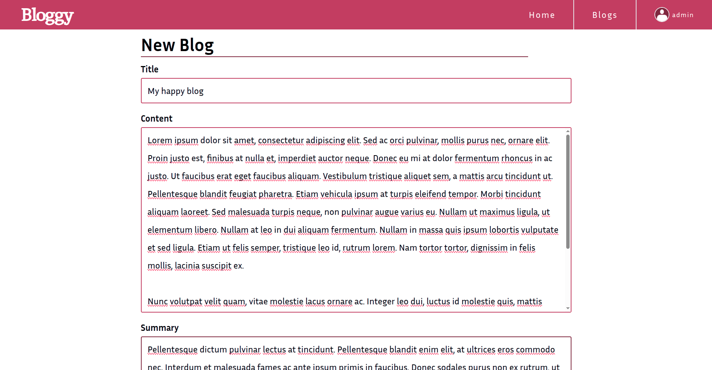

  

# Bloggy

Bloggy is a personal blog website that enables its admin to create, edit, and delete their blog posts and enables users to read, like, and comment on published blog posts.

## How to run

- Run local mongob instance
- Create .env file that contains: 
  `PORT`: server port. 
  `DB_CONNECTION_STRING`: mongodb connection string, `mongodb://127.0.0.1:27017/` for local instance. 
  `ADMIN_USERNAME`: admin username. 
  `ADMIN_PASSWORD`: admin password. 
- Output style.css file `npx tailwindcss -i ./config/input_tailwind.css -o ./public/css/style.css`
- Run the server `node --env-file=.env server.js`

## Preview

